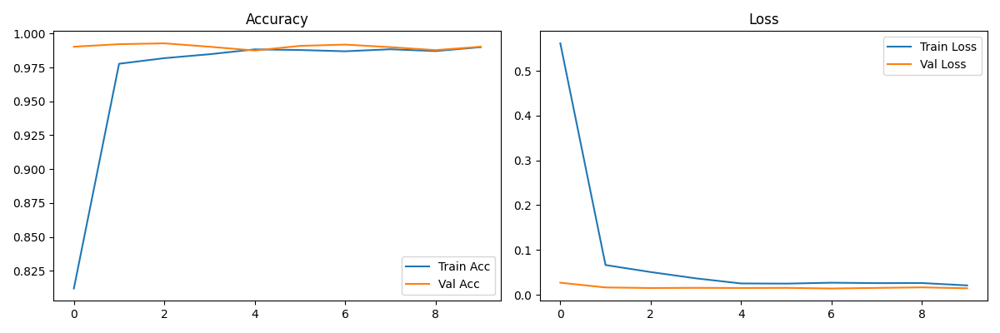

# Hand Gesture Recognition with Real-time Morse Code Translation


A comprehensive real-time hand gesture recognition system that uses computer vision and deep learning to detect hand gestures and translate them into Morse code. Built with TensorFlow, OpenCV, and MediaPipe.

---

## 🎯 Project Overview

This project implements a real-time hand gesture recognition system that detects hand gestures from a webcam feed and translates them into Morse code. The system uses a CNN-based model for gesture classification and MediaPipe for robust hand tracking. It supports 10 different gestures mapped to Morse code symbols and special functions, enabling live translation and interaction.

## 🖼️ Result

Below is a sample result plot showing the model's accuracy during training:



---

## 🚀 Live Demo

Access the live Streamlit app here:  
👉 [Hand Gesture Recognition App](https://hands-gesture-recognition.streamlit.app/)

---

## 🧠 Features

### Core ML Features
- **Deep Learning Model**: CNN-based gesture recognition (97.85% accuracy)
- **Hand Tracking**: Real-time hand detection and tracking using MediaPipe
- **Gesture-to-Morse Mapping**: 10 gestures mapped to Morse code and control functions
- **Live Prediction**: Real-time inference from webcam feed

### Application Features
- **Visual Feedback**: Bounding box and gesture class displayed on video
- **Buffer Management**: Submit, clear, backspace, space, enter, tab, and shift functions
- **User Controls**: Keyboard shortcuts for quitting and clearing buffer

### Technical Features
- **Dataset Management**: Uses LeapGestRecog dataset (20,000 images)
- **Model Persistence**: Save/load trained models (`gesture_model.h5`, `gesture_model_augmented.h5`)
- **Cross-platform**: Works on Windows, Mac, and Linux
- **Robust Error Handling**: Handles missing models, webcam issues, and low accuracy

---

## 📦 Installation & Setup

### Prerequisites
- Python 3.8+
- Webcam
- Good lighting for hand detection

### Quick Start

1. **Clone or download the project:**
   ```bash
   git clone <your-repo-url>
   cd "Hand Gesture Recognition"
   ```

2. **Create a virtual environment:**
   ```bash
   python -m venv venv
   ```

3. **Activate the virtual environment:**
   - Windows: `venv\Scripts\activate`
   - Mac/Linux: `source venv/bin/activate`

4. **Install dependencies:**
   ```bash
   pip install -r requirements.txt
   ```

5. **Download the dataset:**
   ```bash
   kaggle datasets download -d gti-upm/leapgestrecog
   tar -xf leapgestrecog.zip
   ```
   - Place the extracted `leapGestRecog/` folder in the project root.

---

## 🎮 How to Use

### 1. Train the Model (if needed)
```bash
python train_gesture_model.py
```
- Trains the CNN model on the LeapGestRecog dataset.
- Saves the trained model as `gesture_model.h5` or `gesture_model_augmented.h5`.

### 2. Test the Model
```bash
python test_model.py
```
- Evaluates the trained model and displays accuracy and confusion matrix.

### 3. Run Real-time Recognition
```bash
python hand_tracking_gesture.py
```
- Launches the webcam interface for real-time gesture recognition and Morse code translation.

#### Controls
- **Show your hand** in the camera view
- **Make gestures** within the green bounding box
- **Hold gestures steady** for 2-3 seconds
- **Press 'q'** to quit
- **Press 'c'** to clear the Morse buffer

---

## 📊 Model Performance

- **Test Accuracy**: 97.85%
- **Dataset**: LeapGestRecog (20,000 images)
- **Classes**: 10 different hand gestures
- **Architecture**: CNN with BatchNormalization and Dropout
- **Training Time**: ~5-10 minutes
- **Inference Time**: ~2-3 seconds per gesture

### Model Architecture
```
Input Image (64x64x1)
    ↓
Conv2D(32) → BatchNorm → MaxPool2D
    ↓
Conv2D(64) → BatchNorm → MaxPool2D
    ↓
Flatten → Dense(128) → Dropout(0.4) → Dense(10)
    ↓
Gesture Prediction
```

---

## 📁 Project Structure

```
Hand Gesture Recognition/
├── train_gesture_model.py          # Training script
├── hand_tracking_gesture.py        # Real-time recognition with hand tracking
├── test_model.py                   # Model testing script
├── requirements.txt                # Python dependencies
├── gesture_model.h5                # Trained model
├── gesture_model_augmented.h5      # Improved model
├── leapGestRecog/                  # Dataset directory
├── HandGuestureRecognitionDemo.gif # Demo GIF
└── README.md                       # This file
```

---

## 🔧 Technical Details

### Dependencies
- **TensorFlow**: Deep learning framework
- **OpenCV**: Computer vision
- **MediaPipe**: Hand tracking
- **NumPy**: Numerical computing
- **Matplotlib**: Visualization
- **Scikit-learn**: Data processing

### Model Specifications
- **Input Size**: 64x64 grayscale images
- **Classes**: 10 hand gestures
- **Regularization**: BatchNormalization, Dropout

---

## 📋 Gesture Mapping

| Gesture | Morse Code | Function |
|---------|------------|----------|
| 0 | `.` | Dot |
| 1 | `-` | Dash |
| 2 | `x` | Break |
| 3 | `submit` | Submit/Decode buffer |
| 4 | `clear` | Clear buffer |
| 5 | `space` | Space |
| 6 | `backspace` | Backspace |
| 7 | `enter` | Enter |
| 8 | `tab` | Tab |
| 9 | `shift` | Shift |

---

## 🐛 Troubleshooting

### Common Issues

1. **"No module named 'mediapipe'"**
   ```bash
   pip install mediapipe
   ```
2. **Webcam not detected**
   - Check if webcam is connected
   - Try different camera index (0, 1, 2)
3. **Low accuracy**
   - Ensure good lighting
   - Keep hand steady
   - Position hand in the green box
4. **Model loading error**
   - Check if `gesture_model.h5` exists
   - Re-train the model if needed

### Performance Tips
- **Good lighting**: Ensure your hand is well-lit
- **Clean background**: Avoid cluttered backgrounds
- **Steady hand**: Hold gestures for 2-3 seconds
- **Proper distance**: Keep hand at reasonable distance from camera

---

## 🤝 Contributing

Feel free to contribute to this project by:
- Reporting bugs
- Suggesting new features
- Improving the model architecture
- Adding new gesture mappings

---

## 📝 License

This project is open source and available under the MIT License.

---

## 🙏 Acknowledgments

- **Dataset**: [LeapGestRecog](https://www.kaggle.com/datasets/gti-upm/leapgestrecog)
- **Hand Tracking**: MediaPipe
- **Deep Learning**: TensorFlow 